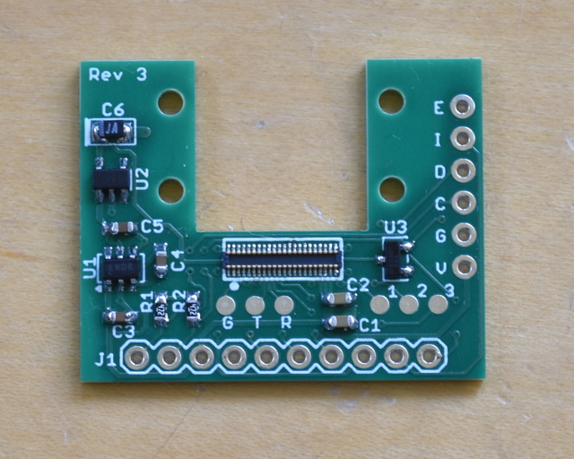
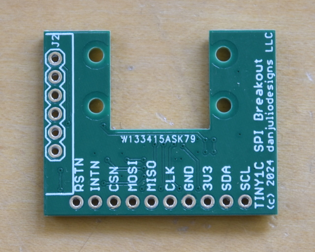
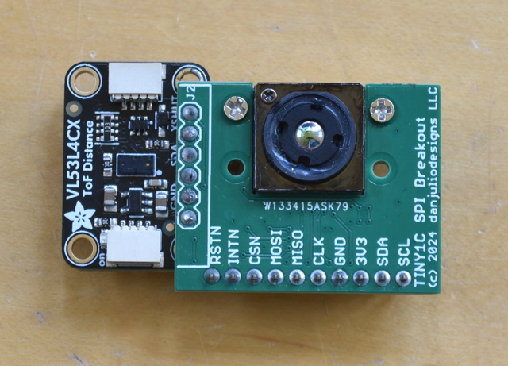
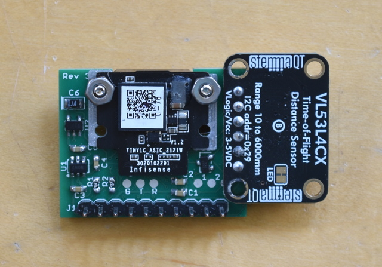
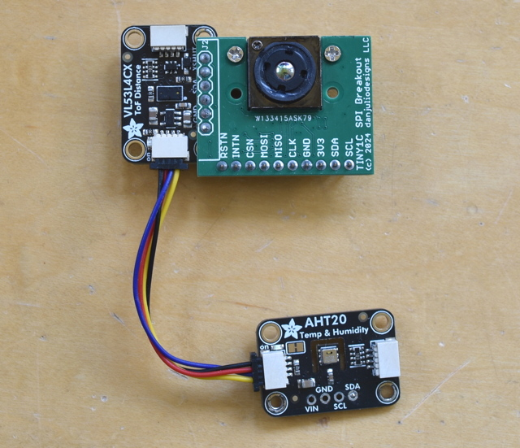
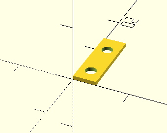

## Tiny1C Breakout PCB
The Tiny1C Breakout PCB is used by both iCam and iCamMini.  It provides access to the Tiny1C VoSPI and I2C Command interfaces, as well as providing a low noise 5V analog power supply for the imager from a 3.3V input supply.  It provides a header interface for the [VL53L4CX](https://www.adafruit.com/product/5425) 4M time-off-flight sensor so that it can be close and aligned with the Tiny1C.  It also provides access to the Tiny1C diagnostic serial port and three of its GPIO signals (currently unused as far as I can tell).

The pinout basically follows the Flir Lepton breakout board sold by Group Gets.

This directory contains the gerber files as well as schematic documentation.






### Gerber Files

* 2 layer board
* 1.25" x 1.0"
* 1.6 mm thickness


| File | Description |
| --- | --- |
| tiny1c_breakout.GBL | Bottom Copper |
| tiny1c_breakout.GBO | Bottom Silkscreen |
| tiny1c_breakout.GBS | Bottom Soldermask |
| tiny1c_breakout.GML | Mill (outline) |
| tiny1c_breakout.GTL | Top Copper |
| tiny1c_breakout.GTO | Top Silkscreen |
| tiny1c_breakout.GTS | Top Soldermask |
| tiny1c_breakout.TXT | Drill |

### Board Connections

| Pin | Description |
| --- | --- |
| SCL | I2C clock signal to Tiny1C and VL53L4CX header |
| SDA | I2C data signal to Tiny1C and VL53L4CX header |
| 3V3 | 3.3V power supply for Tiny1C and VL53L4CX header.  Should be capable of 500 mA. |
| GND | Ground |
| MISO | SPI Data output from Tiny1C |
| MOSI | SPI Data input to Tiny1C |
| CSN | SPI active low chip select for Tiny1C |
| INTN | Active low interrupt from VL53L4CX header |
| RSTN | Active low reset input/output to Tiny1C and VL53L4CX.  See note below. |

The breakout board contains a power-on reset generator that pulls this signal low.  It may also be pulled low using an open-drain output on another controller.  The Tiny1C includes a built-in pull-up resistor on this line.

### Tiny1C Serial Port Connections

| Pad | Description |
| --- | --- |
| G | Ground |
| T | Tiny1C TX |
| R | Tiny1C RX |


### Tiny1C GPIO Port Connections

| Header Pin | Description |
| --- | --- |
| V | 3.3V Power input |
| G | Ground |
| C | I2C SCL |
| D | I2C SDA |
| I | GPIO Interrupt |
| E | Active low shutdown (used as reset input) |

## VL53L4CX Support

VL53L4CX Breakout board may be mounted on either side of the Tiny1C breakout board depending on your enclosure needs.  I used short pieces of cut wire soldered on both sides to hold the boards close together.  The I2C pull-up resistors may be left in place.





The Qwiic connector can be used to attach the AHT20 Temperature/Humidity sensor using a short Qwiic cable.  You want this sensor to be removed from any heat generating components, ideally only sampling the air around the camera.



## Spacer and Tiny1C Mounting

The ```spacer``` subdirectory contains an OpenSCAD design (and resultant STL file) for a spacer that goes between the Tiny1C and the breakout board.  Two of these should be printed on a 3D printer.  Then a set of small screws can be used to secure the Tiny1C to the board.

