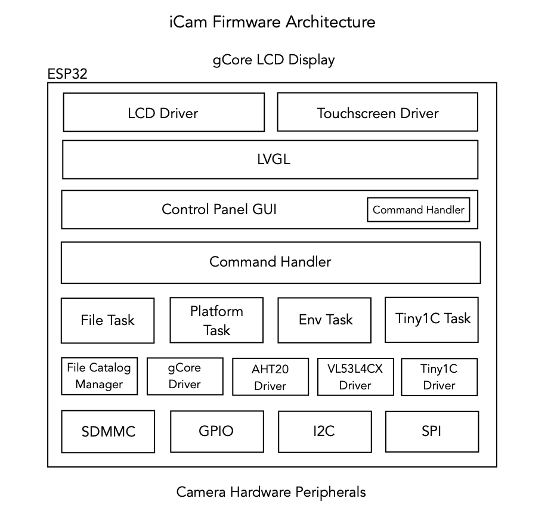
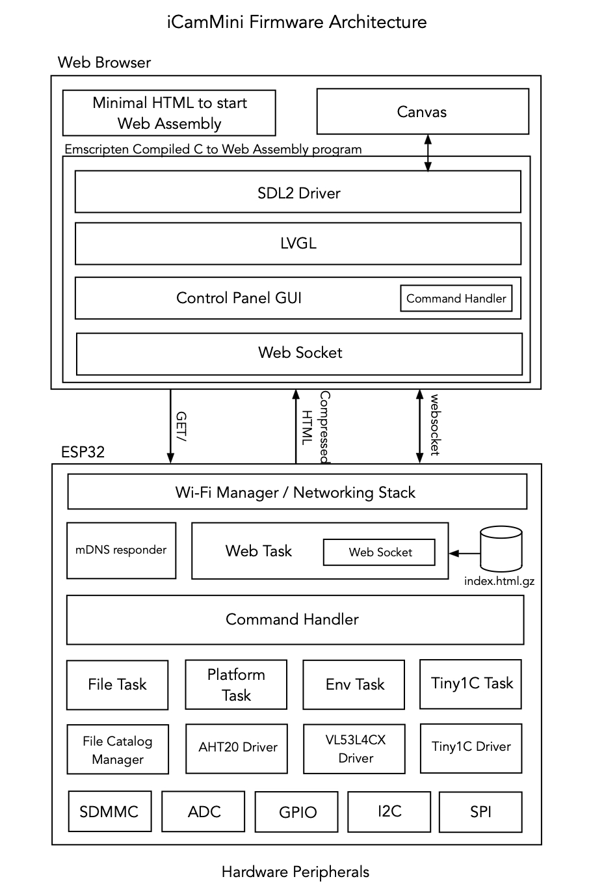
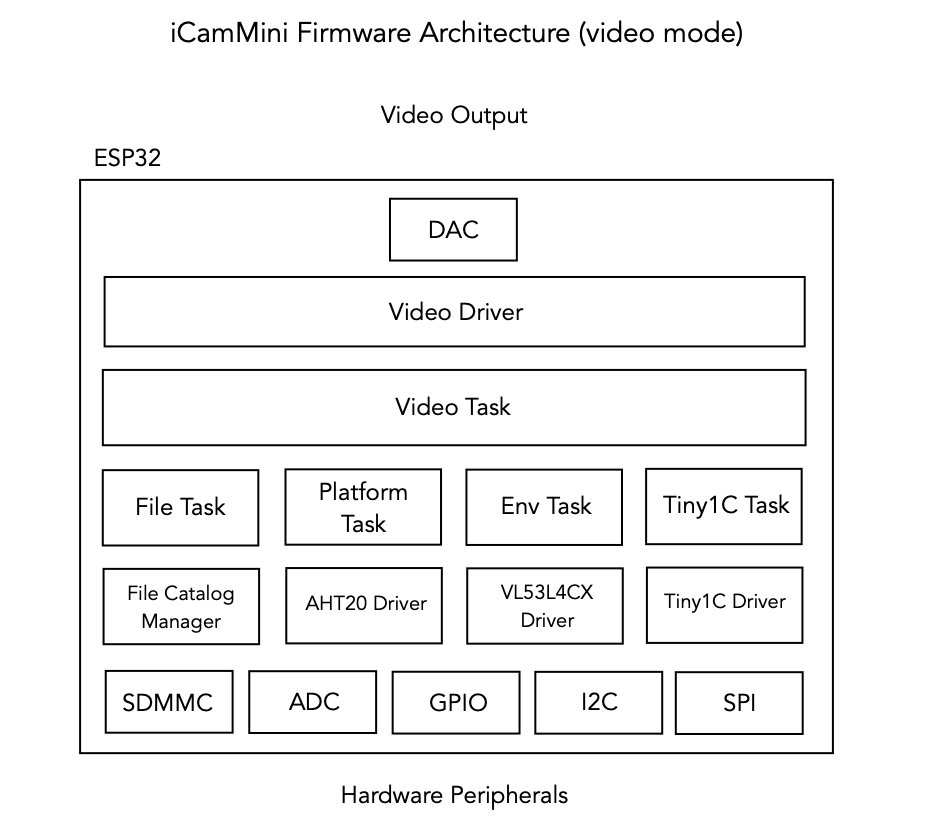

## iCam Firmware
The firmware (```iCamCntrl```) in this directory runs on both iCam (gCore platform) and iCamMini (iCamCntrl platform) using the Espressif IDF.  It must be compiled separately for each platform.  Differences between the platforms are managed by conditionally compiled code.  A portion of this firmware for the iCamMini is also built using emscripten.  Much of the source code (the GUI code itself and the LVGL graphics library) are shared between the ESP32 and emscripten builds (see architecture diagrams below).

### Prerequisites
This firmware requires the following development environments.

1. [Espressif IDF v5.3](https://docs.espressif.com/projects/esp-idf/en/release-v5.3/esp32/index.html)
2. [Emscripten](https://emscripten.org/) - I build with SDK 3.1.64 but later versions should work too.  I also had to install SDL2 (on mac: ```brew install sdl2```).

I build using Mac OS X but this project should be buildable on Linux and Windows platforms as well, perhaps with some changes to shell commands.

### Building for iCam
Building firmware for iCam (gCore) is a straight-forward ESP32 IDF build.

#### Setup
1. Change to the ```firmware``` subdirectory
2. Source (run) the Espressif ```export.sh``` file and setup the ```IDF_PATH``` environment variable.
3. Source (run) the ```set_platform.sh``` script with the argument ```icam```.

``` ./set_platform.sh icam```

#### Build
Build the project using the Espressif tools

```idf.py build```

#### Program

##### Using IDF tools
Plug gCore into your computer and turn it on so that its serial port may be recognized and enumerated by the operating system.  Make a note of the serial port name (for example on OS X it is ```/dev/cu.SLAB_USBtoUART```).

```idf.py -p [SERIAL PORT] -b 921600 flash```

where SERIAL PORT is the serial port associated with gCore.

##### Using the Windows-based Espressif programming tool
The precompiled firmware files found in the ```iCam/precompiled``` directory may be downloaded without having to build them using the Windows-based Espressif Flash Download tool that can be found [here](https://www.espressif.com/en/support/download/other-tools).

The various files are loaded in flash memory as follows.

| Binary File | Flash Location |
| --- | --- |
| bootloader.bin | 0x1000 |
| iCamCntrl.bin | 0x10000 |
| partion-table.bin | 0x8000 |
| ota\_data\_initial.bin | 0xd000 |
| storage.bin | 0xb10000 |

#### Serial Diagnostic data

The firmware logs various events to gCore's USB serial port.  This may be viewed by connecting the Espressif serial monitor as shown below.

```idf.py -p [SERIAL PORT] monitor```

### Building for iCamMini
Building firmware for iCamMini (iCamCntrl hardware) is a two-step process.

1. Build the HTML page that the camera sends to the browser using emscripten, compress it and copy it to the Espressif project.
2. Build the Espressif project and load the combined binary into the camera.

#### Emscripten build
Build the emscripten portion before building and programming the ESP32 portion.  This only needs to be done initially or when any part of the emscripten source changes.

1. One time only: change directory to the ```emscripten``` subdirectory and create a ```build``` directory there.
2. Change directory to ```emscripten/build``` subdirectory in a shell dedicated to building the emscripten portion of the firmware.
3. Source the emscripten ```emsdk_env.sh``` file to configure the emscripten environment.
4. First time and only when you add new source files to the emscripten build: run the command ```emcmake cmake ..```
5. Build the emscripten code: ```emmake make -j4```
6. Compress the resultant html file: ```gzip index.html```
7. Move the compressed file into the ESP32 build area: ```mv index.html.gz ../../components/esp32_web```

Steps 5-7 are performed each time a change is made to the existing firmware.  Perform step 4 when the file structure changes.

#### ESP32 build
I build the ESP32 portion using another shell window.  It is done after making any emscripten changes.  The compressed HTML file must be built and stored in the ```components/esp32_web``` subdirectory.

1. Change directory to the ```firmware``` subdirectory.
2. Configure the project to build for iCamMini: ``` ./set_platform.sh icam_mini```
3. Build the project using the Espressif tools:```idf.py build```

#### Program

##### Using IDF tools
Plug the iCamCntrl board into your computer and press and hold the power button so that its serial port may be recognized and enumerated by the operating system.  Make a note of the serial port name (for example on OS X it is something like ```/dev/cu.wchusbserial110```).

```idf.py -p [SERIAL PORT] -b 921600 flash```

where SERIAL PORT is the serial port associated with iCamCntrl.

##### Note about iCamCntrl power
You must continue to hold the power button on during programming because the hardware implements a soft power control in firmware.  When firmware is not running then it cannot drive a GPIO output that holds power enabled.  You may release the power button after programming is finished.

When programming is finished then press the power button and hold until the status LED lights.   At this point the firmware is driving the power hold signal.

##### Using the Windows-based Espressif programming tool
The precompiled firmware files found in the ```iCamMini/precompiled``` directory may be downloaded without having to build them using the Windows-based Espressif Flash Download tool that can be found [here](https://www.espressif.com/en/support/download/other-tools).

The various files are loaded in flash memory as follows.

| Binary File | Flash Location |
| --- | --- |
| bootloader.bin | 0x1000 |
| iCamCntrl.bin | 0x10000 |
| partion-table.bin | 0x8000 |
| ota\_data\_initial.bin | 0xd000 |
| storage.bin | 0x710000 |

#### Serial Diagnostic data

The firmware logs various events to iCamCntrl's USB serial port.  This may be viewed by connecting the Espressif serial monitor as shown below.

```idf.py -p [SERIAL PORT] monitor```

### Firmware Architecture
Most of the code is shared between both platforms.  Aside from platform-specific functionality (and analog video output) the main difference is in where the LVGL-based GUI runs.  In order to support this architecture the GUI display is separated from the camera application code by a SET/GET/RESPONSE command interface.  These commands are used to get and update state on both sides of the interface.  In iCam they become direct function calls between domains and in iCamMini they are serialized and deserialized across a websocket interface.





The command interface is not used when iCamMini is configured for video output.



