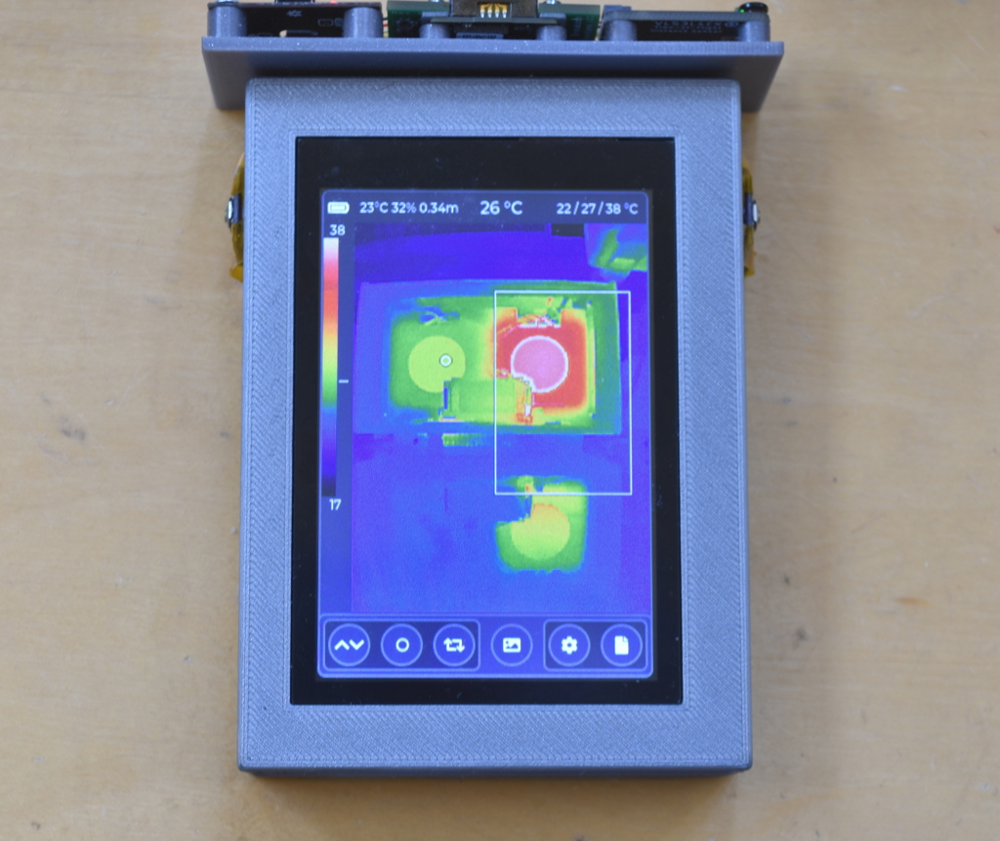

## iCam Prototype
I call this a prototype because I'd like to design a better enclosure but the camera itself is functional.




Instructions for programming the precompiled firmware may be found in the ```firmware``` directory.

### Hardware Architecture
The hardware consists of a [gCore](https://github.com/danjulio/gCore) development board with Tiny1C, VL53L4CX and AHT20 breakout boards.


Note that the reset signal goes to both the Tiny1C and VL53L4CX boards.  This is necessary as the firmware resets the hardware before configuring it and the VL53L4CX will malfunction if you attempt to reconfigure it after it has been running without a reset.

### Prototype Enclosure
The enclosure consists of two 3D printed parts, the gCore enclosure (which you can find at the gCore repo) and a sensor mount that's double-sticky tape attached to the gCore enclosure.


The OpenSCAD design and resultant STL file for the sensor mount may be found in the ```sensor_mount``` subdirectory.  Note that for this prototype I used a Sparkfun AHT20 breakout board so the mount will have to be redesigned to use the Adafruit version (just copy the VL53L4CX portion over).


Note that I wired two buttons on this prototype but they are currently unused by the firmware.