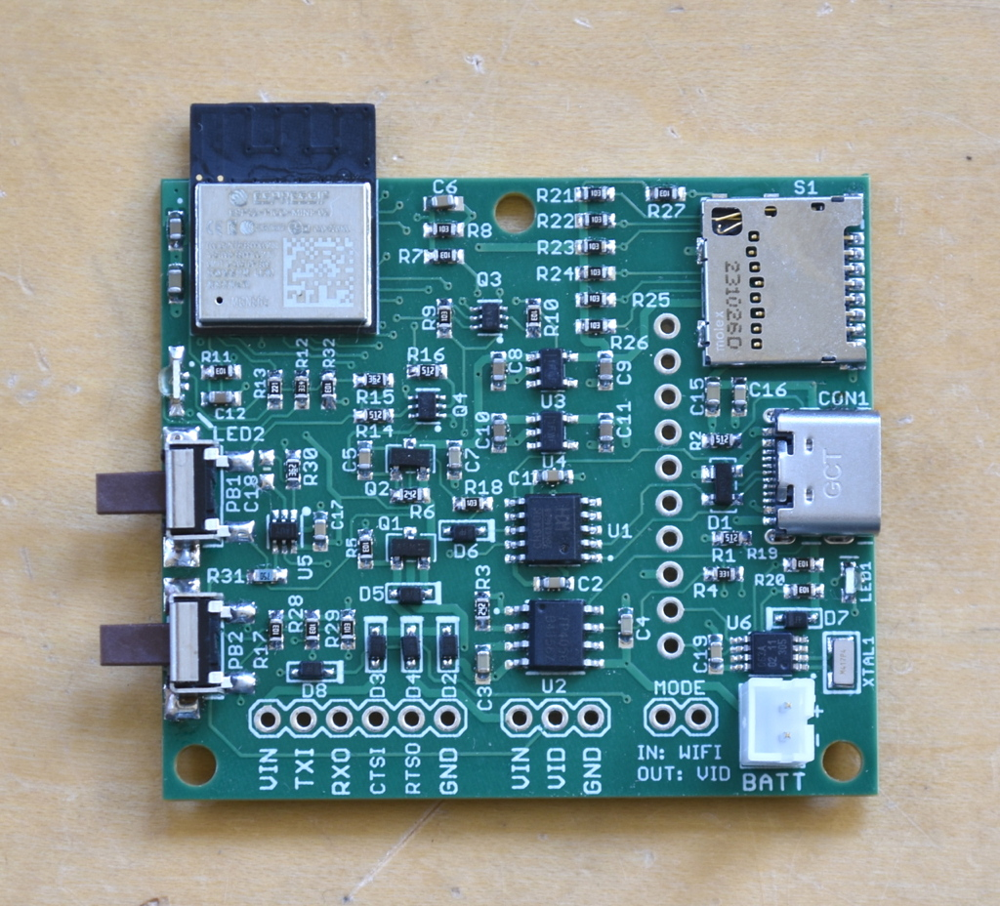
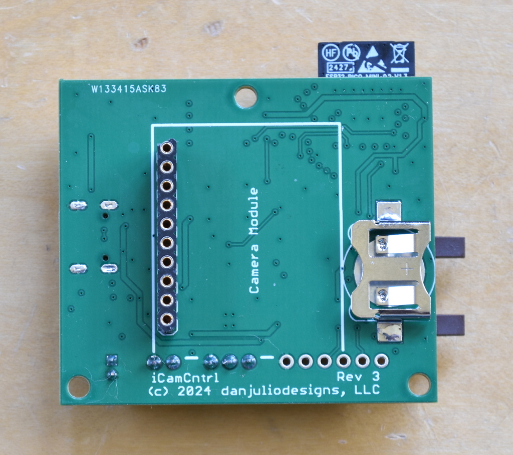
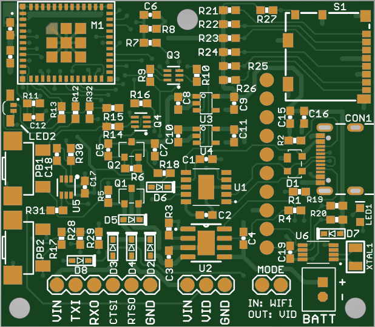
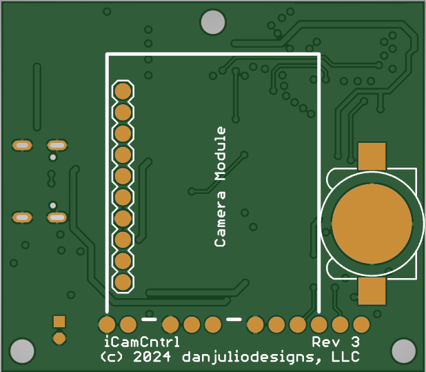

## iCamCntrl PCB
The iCamCntrl PCB forms the core of iCamMini.  It contains the following main subsystems.

1. ESP32-PICO-MINI-02 with 8 MB Flash and 2 MB PSRAM.
2. CH340K based USB UART and USB-C connector for programming and diagnostic output.
3. TP4056 Li-Ion battery charger.
4. Soft power control switching circuitry.
5. Micro-SD card (SPI Interface).
6. PCF85063ATT battery-backed RTC.
7. OPA361 video amplifier and driver, 75 ohm video output.
8. Serial interface with flow control (currently unused).
9. Separate 3.3V power supply for Tiny1C breakout for added noise reduction when generating the Tiny1C 5V analog supply.

It has a flexible power input sources.

1. USB Power (charges battery).
2. 3.7 Volt Li-Ion battery with Sparkfun/Adafruit connector.
3. 5V in on video port (for example may be used for a 3-wire connection on a drone).
4. 5V in on serial port (for example may be used when connected to a UAV controller).

All inputs are diode-isolated.

### PCB
* 4 layer board
* 2.0" x 1.75"
* 1.6 mm thickness

### Gerber Files

| File | Description |
| --- | --- |
| iCamCntrl.GBL | Bottom Copper (layer 4) |
| iCamCntrl.GBO | Bottom Silkscreen |
| iCamCntrl.GBS | Bottom Soldermask |
| iCamCntrl.GL3 | Internal Copper (layer 3) |
| iCamCntrl.GL2 | Internal Copper (layer 2) |
| iCamCntrl.GML | Mill (outline) |
| iCamCntrl.GTL | Top Copper (layer 1) |
| iCamCntrl.GTO | Top Silkscreen |
| iCamCntrl.GTS | Top Soldermask |
| iCamCntrl.TXT | Drill |

### Soft Power Control
Soft Power Control is implemented using a high-side P-Channel MOSFET transistor.  It is enabled when PB1 is pressed.  Then firmware running on the ESP32 must drive the PWR\_HLD signal before the button is released to hold power.  This allows the ESP32 to shut power off by de-asserting PWR\_HLD.  The firmware lights the LED immediately after asserting PWR_HLD at boot as a prompt to the user that they can release the button.  However releasing the button before the ESP32 will result in the board powering down.