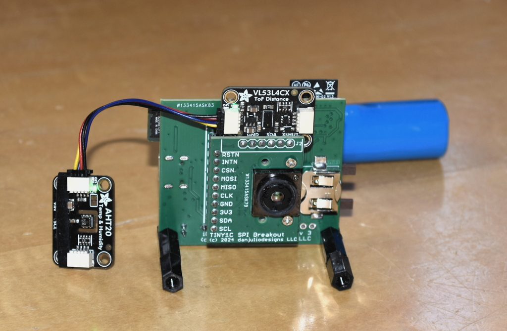
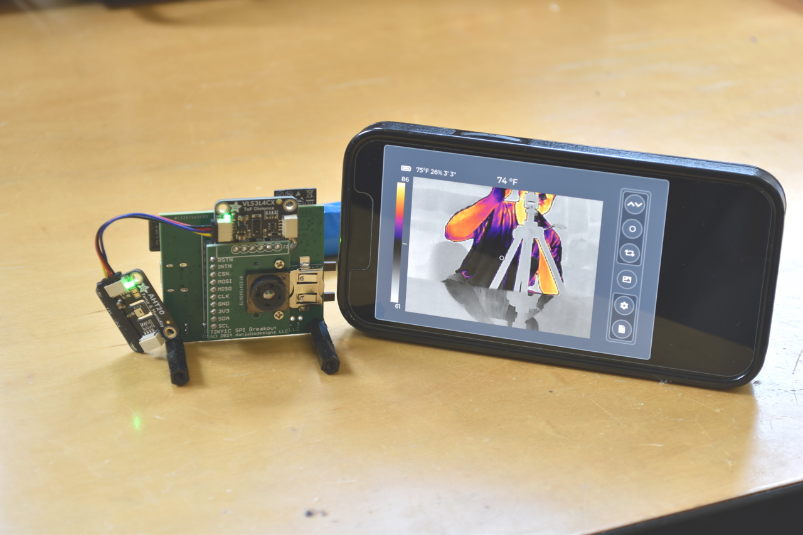
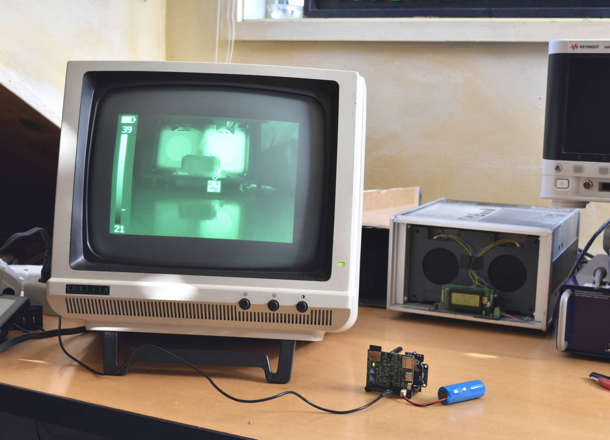
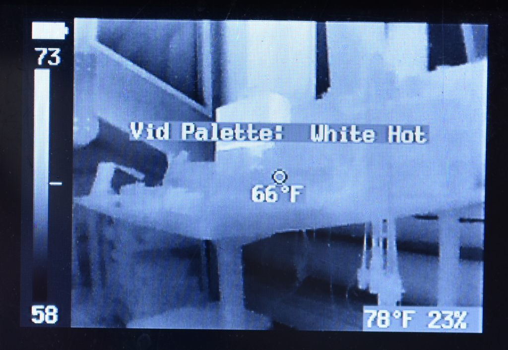
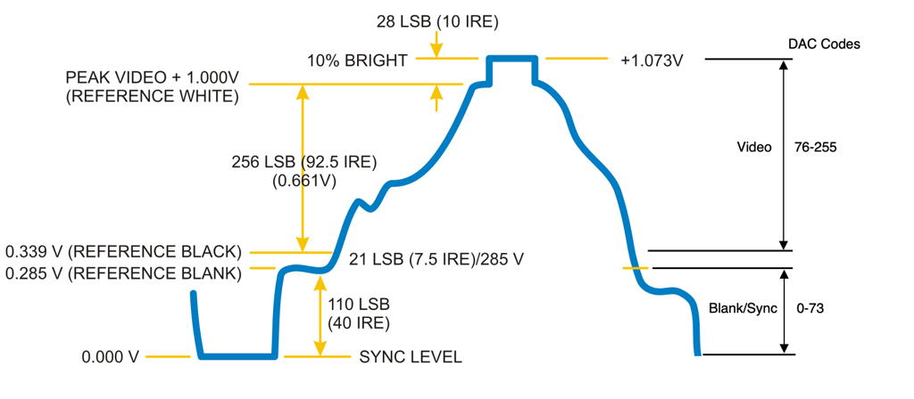
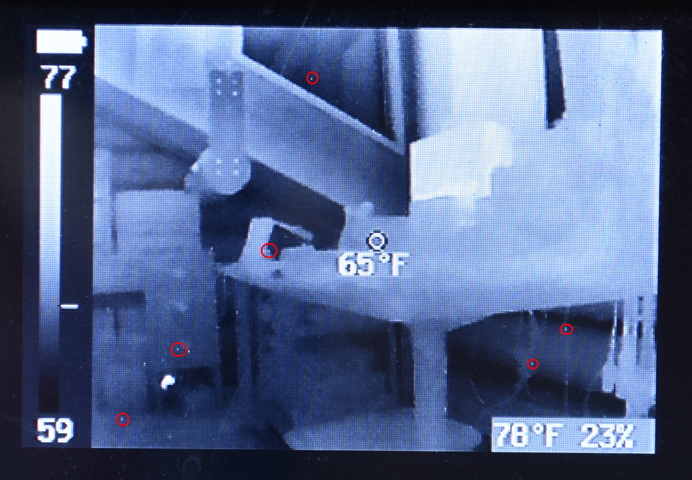

## iCamMini
iCamMini is a small, battery powered, thermal imaging camera with two different output modes.  It can communicate with a remote web browser over Wi-Fi or it can output an analog video output with either NTSC or PAL timing.

It is comprised of a iCamCntrl main board and Tiny1C Breakout board.  Optionally a VL53L4CX and/or AHT20 breakout board may be added sensing environmental conditions to improve the radiometric accuracy of the camera.







The iCamCntrl hardware is documented in the ```iCamCntrl_board``` subdirectory.

### Battery
iCamMini can operate with or without a 3.7V Li-Ion battery.  The Li-Ion battery charger provides up to 500 mA of charge current.  The battery should be 2500 mA or less.  The camera typically operates between 200-300 mA (with bursts when the Tiny1C performs a flat-field correction).

#### RTC Battery
The real-time clock is kept powered when the camera is off using a CR1225 3V Lithium coin cell.

### Mode Selection
The output mode is selected at boot using the MODE jumper.  It cannot be changed once the camera is running.

| Jumper Position | Mode |
| --- | --- |
| In | Wi-Fi/Web Browser mode |
| Out | Analog output mode |

### Board Controls
The board contains two push buttons (PB1, PB2) and two LEDs (LED1, LED2).  LED1 is a blue LED.  LED2 is a red/green LED capable of three colors (Red, Green, Orange/Yello).

PB1 is always used to turn the board on or off.  Hold PB1 pressed until LED2 lights.  Then you can release it.  To turn the camera off, press and hold the button for more than three seconds (long-press).  LED2 will turn off then you can release the button.

LED1 is lit when the battery is charging.

LED2 is initially red.  It switches to another, mode-dependent color, when the camera has successfully booted (passed all self-tests and configured all peripherals).  It will blink red if any errors are detected, followed by a short period where it is off.  The number of blinks indicate the failing function. 

| Blinks | Fault Type |
| --- | --- |
| 1 | ESP32 core initialization failed |
| 2 | ESP32 peripheral initialization failed |
| 3 | ESP32 static memory allocation failed |
| 4 | Tiny1C CCI initialization failed |
| 5 | Tiny1C VoSPI communication failed |
| 6 | Tiny1C video stream sync failed |
| 7 | Video output initialization failed |
| 8 | Web Server failure |

LED2 also briefly blinks whenever a picture is taken and stored on the Micro-SD card.

The remaining functionality of the buttons and LED2 depends on what output mode the camera is running. 

### Wi-Fi / Web Browser Mode
LED2 indicates connectivity mode.

| LED2 | Meaning |
| --- | --- |
| Fast Blinking Orange | Wi-Fi Reset |
| Slow Blinking Orange | AP Mode: No device connected |
| | STA Mode: Not connected to AP |
| Solid Orange | AP Mode: Device connected |
| | STA Mode: Connected to AP |
| Solid Green | Client connected (web browser connected) |

#### Button 1

| Press Type | Function |
| --- | --- |
| Short Press | Take Picture when not in settings mode.  Select next parameter value when in settings mode. |
| Long Press | Turn camera off |

#### Button 2

| Press Type | Function |
| --- | --- |
| Short Press | No function. |
| Long Press | Wifi Reset back to default AP settings. |

### Video Output Mode

LED2 turns from red to green to indicate the camera has booted successfully (passed all self-tests and configured all peripherals).

#### Button 1

| Press Type | Function |
| --- | --- |
| Short Press | Take Picture when not in settings mode.  Select next parameter value when in settings mode. |
| Long Press | Turn camera off |

#### Button 2

| Press Type | Function |
| --- | --- |
| Short Press | No function when not in settings mode.  Select next parameter when in settings mode. |
| Long Press | Enter/Exit settings mode. |

#### Video Output Mode Settings

Camera parameters are changed in video output mode by entering settings mode (Button 2 long press).  Short press Button 1 to select among parameter values.  Short press Button 2 to select next parameter.  Long press Button 2 to exit settings mode.

The current parameter and value is displayed on the video output screen.



| Parameter | Description |
| --- | --- |
| Vid Palette | Selects between White-hot and Black-hot video output palettes. |
| Spot | Sets Spot (centered) temperature display on or off. |
| Min/Max Markers | Sets minimum and maximum temperature markers on or off. |
| FFC | Triggers a flat-field correction in the Tiny1C. |
| Brightness | Sets the Tiny1C video pipeline output brightness. |
| Emissivity | Sets the Tiny1C Emissivity between a set of pre-defined values. |
| Gain | Sets the Tiny1C to Low or High gain. |
| Env Correct | Sets environmental correction on or off.  Note that use of sensors and/or pre-defined values is configured via the control panel in Wi-Fi mode. |  
| Save Overlay | Sets the metadata information display on saved images on or off. |
| Save Palette | Selects one of the ten pseudo-color palettes to use when saving images. |
| Timelapse | Sets timelapse mode on or off.  When on, pressing the Take Picture button starts the timelapse sequence. |
| Timelapse Interval | Sets the interval between timelapse photos from a predefined set of intervals. |
| Timelapse Images | Sets the number of timelapse photos to take from a predefined set of pictures. |
| Tmelapse Notify | Sets the notification of each timelapse picture taken on the video output screen on or off. |
| Units | Selects between Metric (°C) and Imperial (°F) display units. |
| Video | Selects between NTSC and PAL video timing. |

### Video Output
Video output uses the ESP32 8-bit DAC so it is not a perfect display.  DAC codes are allocated as follows.



The DAC also exhibits some output switch noise that manifests in a sparkling noise overlaying the image.


