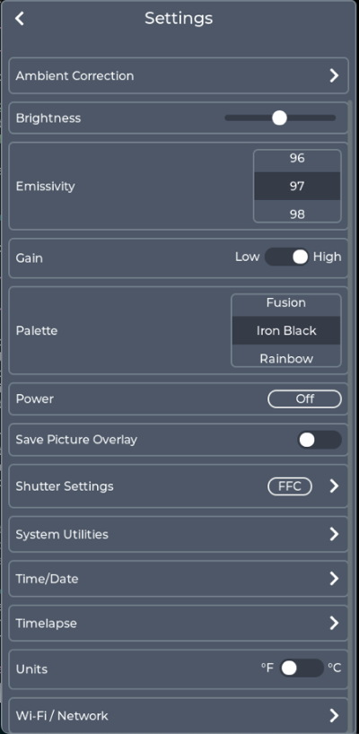
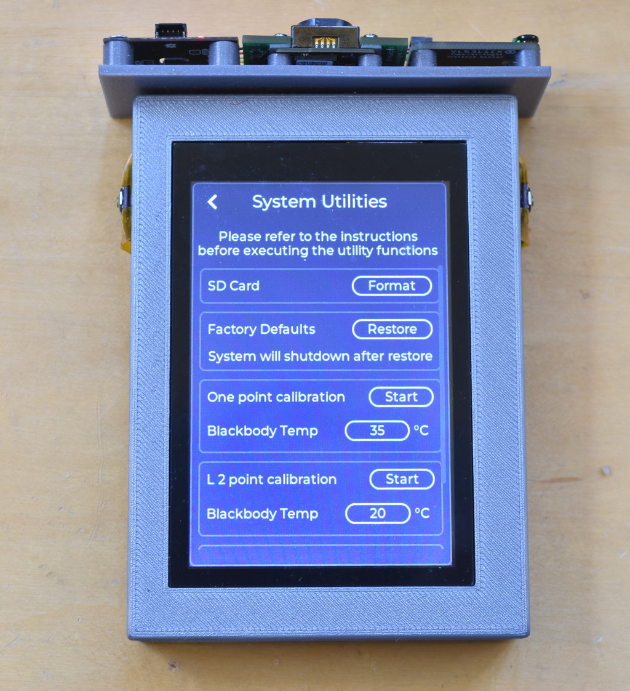

## iCam and iCamMini thermal imaging cameras


This repository contains the design files for my Infiray Tiny1C-based thermal imaging cameras.  It also contains the documentation I have for the Tiny1C module from Infiray.

1. iCam - Handheld camera with local LCD touchscreen based on my ESP32 [gCore](https://github.com/danjulio/gCore) development board and the Tiny1C breakout board in this repository.
2. iCamMini - Portable camera with either web-based access or NTSC/PAL video output based on the iCamCntrl board in this repository and the Tiny1C breakout board.

The cameras share a common code base and feature set.

1. 256 x 192 pixel resolution.
2. Radiometric operation with adjustable emissivity.
3. Support for optional environmental (object distance, temperature and humidity) correction.
4. Adjustable high/low gain for extended temperature detection.
5. Support for calibration against a black body radiator.
6. Ten pseudo-color palettes.
7. Image storage and playback as jpg files on a Micro-SD card.
8. Selectable point and region markers.
9. Scene min/max temperature display.
10. Timelapse operation.
11. Battery-backed real-time clock for time stamping.
12. Rechargeable Li-Ion battery power source (or USB/external power).

tCam display is a local 16bpp 480x320 pixels capacitive touchscreen LCD.

tCamMini display is either via a Wi-Fi connected remote web browser (mobile aware) or analog video output (NTSC or PAL).  Analog video output may be used for long-distance operation, for example mounted on a UAV with video transmission capability.

### GUI
The main user interface screen is shown below.


iCamMini also generates a simplified display when configured for analog video output.


Please see the readme in the iCamMini subdirectory for operation of the camera when configured for analog video output.

#### Settings
The settings screen configures the camera.  Most settings are identical on both cameras (for example, iCam does not have a Wi-Fi settings screen, iCamMini does not have a local brightness control).



##### Ambient Correction
Compensation factors for environmental conditions including ambient temperature and distance to object may be applied to improve radiometric temperature accuracy.  Currently humidity correction is not supported.


These compensation factors may be configured manually through the Ambient Correction screen or automatically if [AHT20](https://www.adafruit.com/product/4566) Temperature/Humidity sensor and/or [VL53L4CX](https://www.adafruit.com/product/5425) 4M time-off-flight sensors are connected to the camera's I2C interface.  These sensors are automatically detected and applied if enabled in the Ambient Correction screen.

##### Tiny1C Calibration
One- or two-point calibration against a known black body radiator may be performed.




During calibration the camera should be 25 cm from a known black body radiator at a stable temperature.  The black body emissivity should be configured in the Emissivity Settings panel, and gain configured in the Gain Settings panel.

Two-point calibration is more accurate than one-point calibration but requires two widely separated black body temperatures (e.g. 293K and 393K in high gain and 373K and 673K in low gain).

Set the black body radiator temperature and then press ```Start```.  For two-point calibration, perform the ```L 2 point calibration``` and then perform the ```H 2 point calibration```.

##### Shutter configuration
Parameters related to automatic Flat Field Correction using the Tiny1C's built-in shutter are configured using the Shutter Settings screen.


##### Time / Date
The camera's clock is set through the Time/Date screen.  The clock is used to time stamp stored images.

.

Pressing the ```Autoset``` button (iCamMini only) sets the camera to the host computer's current time.

##### Timelapse Operation
The camera may be configured to periodically take a picture.  The time between photographs and the number of photographs to take is configurable.


Enabling Save Notifications will display the image name on the Main screen as it is taken.  The Main screen Take Picture button turns red while timelapse operation is in progress.

#### File Browser
Clicking the Take Picture button on the main screen (or pressing one of the buttons on iCamMini) stores the current image as a jpg file on the Micro-SD card if present.  The File Browser screen allows displaying and deleting image files.


Note the conversion process to a jpg image takes a few hundred milliseconds.

##### Image Files
Files are stored on the Micro-SD card using a DCIM compatible structure with 100 pictures per folder.

* Folder naming convention: ```nnnICAMF``` where ```nnn``` is a numeric sequence starting at 100.
* File naming convention: ```ICAM_nnnn.JPG``` where ```nnnn``` is a numeric sequence starting at 0001.

Files are 256x192 pixels in size.  An optional overlay of meta-data information can be included when the Save Picture Overlay is enable on the Main Settings screen.


#### iCamMini Wi-Fi operation
When configured for Wi-Fi operation iCamMini is capable of acting as an Access Point (default) or a client connected to an existing Wi-Fi network.

It supports an mDNS responder that allows discovery from a web browser without having to know the IPV4 address.  The mDNS responder recognizes the local URL ```icam.local```.


The Wi-Fi settings allow configuring the mode as well as an optional static IP address when configured into STA mode.


